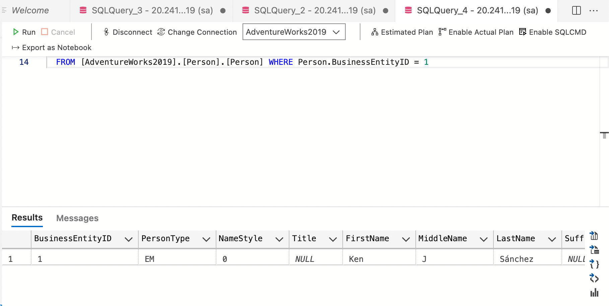
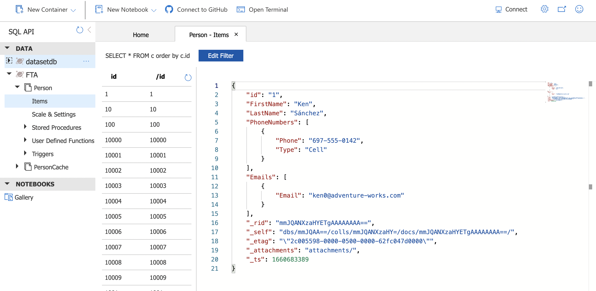

# SQL Cosmos Replication

This prototype illustrates how to use CosmosDb as a high performance cache layer.

SQL databases are typically normalized, which often leads to complex code, slow response times and high resource utilization when requests need to combine/filter data from multiple tables.

One of the main characteristics of document databases is that all data elements are contained inside the document, making them well suited to represent complex structures such as insurance policies, sales orders and demographics.

In this example we leverage AdventureWorks2019, converting the Person table along with Emails and Phones to a cosmosdb collection named Person.

The components are designed to be as generic as possible. The construction of the JSON records is encapsulated in a stored procedure by leveraging `FOR JSON` clauses. There are two control tables: one which defines which collections should be exported, and another which stores the export history. Finally a generic C# utility can be used to export any collection, in a metadata driven fashion.

This demo was created in collaboration with Luciano Moreira ((https://github.com/luticm)) and Marco Cardoso ([MarcoCardoso](https://github.com/MarcoCardoso))

## Quickstart instructions (AdventureWorks2019)

You can use the following quickstart instructions to run an example migration using the AdventureWorks database. The same structure may be used for your own database by following the instructions further below.

1. Prepare an AdventureWorks2019 database deployment. You can download a backup from [here](https://docs.microsoft.com/en-us/sql/samples/adventureworks-install-configure?view=sql-server-ver16&tabs=ssms).
2. Execute AW2019_Importer.sql in an AdventureWorks2019 database. This will:
    - Create control tables to track executions of the importer script;
    - Create some stored procedures we will need;
3. Configure appsettings.json with the connection data to both SQL and CosmosDB. An example is provided in appsettings.example.json;
3. Execure the SqlToCosmosCore project;
4. Review the execution logs

Here's an example of what a record in SQL should show up as in CosmosDB:

## Setup for your database

In order to set up the script for your own database, follow the instructions below.

**Disclaimer: Please note this is intended as learning material, and probably not suitable for your production environments as is. You may use the included configuration files and instructions as a starting point, but they are provided without warranty of any kind.**

1. Make sure your source tables have a column for last modification date. For best results, create an index for this column;
2. Create your own control table to track executions. Minimally, it should contain the date range (start and end times) of the import executions.
3. Implement a [start] procedure that:
    - Checks the control table for the last import execution time;
    - Calculates the date range to be imported;
    - Inserts a new record in the control table;
    - Returns a start date, an end date, and the name of the [read] procedure mentioned below;
4. Implement a [read] procedure that:
    - Receives a date range as input;
    - Selects all records that need to be updated;
    - For those records, returns a table containing the following columns:
        - ID: the record's primary key;
        - PARTITION_KEY: the collection's partition key column, even if it is the primary key;
        - JSON: the record to be inserted in CosmosDB, in JSON format (use the FOR JSON clause).
5. Implement an [end] procedure that:
    - Updates the control table with execution results.
6. Configure appsettings.json with the connection data to both SQL and CosmosDB. An example is provided in appsettings.example.json;
7. Execure the SqlToCosmosCore project;
8. Review the execution logs.
